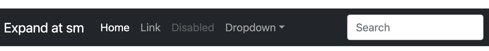

# learn-css
Repositorio para aprende CSS desde cero

CSS (Cascade StyleSheets) significa *hoja de estilos en cascada* y es el lenguaje usado para colocar formato de estilos en los elementos de HTML.

No solo sirve para web, también se puede usar para colocar los estilos de otros medios como:

- Impresión
- Diseños gráficos
- Etc.

## ¿Por qué CSS?

- HTML nunca se diseño para colocar estilos en las webs.
- La tendencia de etiquetas para estilos (`font`, `center`, ...) se abandonó.
- Se usa CSS para colocar los estilos de las webs:


Ejemplo de sintaxis CSS aplicado a un `<p>`:

```css
  p {
    color: red;
    text-align: center;
  }
```

Prioridad de Cascada

- Selectores más específicos tienen prioridad y 
- Selectores que aparecen "después" (más abajo en el `.css`) ante igualdad de condiciones tienen prioridad:

```css
  p {
    color: red;
  }
  /* Este tiene prioridad para los de la clase "clase": */
  p.clase {
    color:green;
  }
```

```css
  h1 { color: tomato; }
  ... varias líneas después ...
  /* Este mismo selector sobreescribe al anterior: */
  h1 { color: red; }
```

Además: 

- `Inline` tiene máxima prioridad
- `External` e `internal` > estilos por defecto del navegador

---

Contenido basado en el itinerario de CSS de W3Schools: https://www.w3schools.com/css/default.asp

---

## Indicaciones generales sobre el repositorio:

### Git

Para clonar repositorio, vamos al repositorio > Code > SSH y copiamos la URL (`git@... .git`)
```
  git clone <URL>
```

La primera vez que clonais os saldrá el aviso de que no hay un user configurado, entonces:

```
  git config --global user.name "<Nombre>"
```

Es recomendable que coloqueis el email de Github:
```
  git config --global user.email "<email>"
```
Para subir un cambio:
1. Abrir la carpeta en Code 👉(**la carpeta que habéis clonado antes**)
2. Hacéis un cambio en cualquier archivo 👉(**Guardad**)
3. Abrid el icono de control de cambios: 
4. Usamos el icono del + para añadir todo:

5. Escribimos un mensaje que explique qué hemos hecho
6. Commit & push

7. gg ez

---

### Referencias

- Para crear llave abrid CMD y ejecutad `ssh-keygen` > Enter hasta el final y la llave estará en una ruta que sale en uno de estos pasos, algo como `C:\Users\<tu_usuario>/.ssh/id_rsa.pub` en Windows y algo como `/home/<usuario>/.ssh` en Linux. En Mac (wip)
- https://docs.github.com/es/authentication/connecting-to-github-with-ssh/adding-a-new-ssh-key-to-your-github-account

### Si hay que dejar de usar un ordenador...

Opciones:
1. Borrad las llaves de ese ordenador `id_rsa.pub` y `id_rsa`
2. Ir a Github y borrar la llave pública