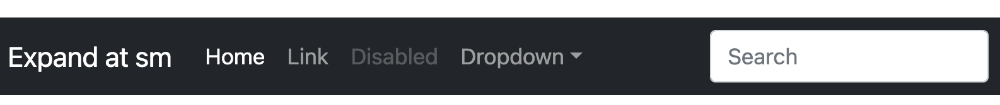
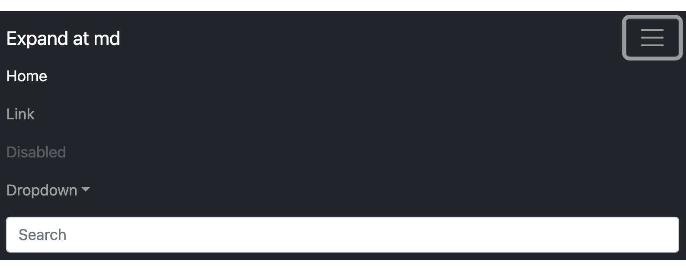

# Ejercicios de CSS

## Parte 1

1. **Estilización de un Contenedor con CSS:**
   - **Explicación:** Crea un contenedor HTML y aplica estilos CSS para definir márgenes, relleno, fondo, bordes y dimensiones.
   - **Pseudocódigo:**
     ```plaintext
     1. Crear un elemento div en HTML con clase "mi-contenedor".
     2. Aplicar estilos CSS a ".mi-contenedor" para:
        - Establecer un ancho del 80% y un máximo de 600px.
        - Centrar el contenedor horizontalmente usando márgenes automáticos.
        - Agregar relleno interno de 20px.
        - Establecer un fondo de color #f0f0f0.
        - Agregar un borde sólido de 2px de color #ccc.
        - Utilizar box-sizing: border-box para incluir el borde en el tamaño total.
     ```

2. **Creación de un Diseño Responsivo con Media Queries:**
   - **Explicación:** Diseña una página web que se adapte a diferentes tamaños de pantalla utilizando media queries en CSS para ajustar estilos según la resolución.
   - **Pseudocódigo:**
     ```plaintext
     1. Definir estilos base para dispositivos móviles.
     2. Utilizar media queries para aplicar estilos específicos según el ancho de la pantalla.
        - Por ejemplo, aumentar el tamaño de fuente para pantallas más grandes.
        - Reorganizar el diseño o modificar propiedades de diseño según la resolución.
     ```

     ```html
         <h1 id="h1">Título responsive</h1>
         <!-- Cambiar la orientación de los elementos en pantalla pequeña: de fila a columna -->
         <p>lorem ... </p>
         <p>lorem ... </p>
         <p>lorem ... </p>
     ```
     
     ```css
         @media screen and (max-width: 600px){
            h1 {
               /* Estilos a aplicar cuando la pantalla 
               es de menos de 600 px */
            }
         }
     ```

     <!-- Galería de fotos -->

     ```html
         <div id="container">
            
            
            
            
            
            
            
         </div>
     ```

     ```css
         #container {
            display:flex;
            flex-direction: row;
            justify-content: space-around;
            align-items: center;
            flex-wrap: wrap;
         }

         @media screen and (max-width: 600px) {
            flex-direction: column; /* cambia la orientación a columna en móvil */
         }
     ```
3. **Implementación Básica de Efecto Parallax con CSS:**
   - **Explicación:** Crea un efecto parallax simple utilizando CSS para añadir profundidad visual a una página web.
   - **Pseudocódigo:**
     ```plaintext
     1. Crear capas o secciones en HTML con diferentes fondos.
     2. Utilizar posicionamiento absoluto o fijo en CSS para las capas.
     3. Aplicar transformaciones (como translateZ (*opcional*)) en las capas para simular el efecto parallax al hacer scroll. 
     
     El efecto parallax se puede hacer con:
     
     background-attachment: fixed;
     ```

     ```html
         <div id="container">
            <p> lorem ... </p>
         </div>
     ```

     ```css
         #container {
            height: 500px;
            background-image: url("img.png");
            background-attachment: fixed;
            /* Más estilos ... */
         }
     ```

4. **Diseño de Galería de Imágenes con Efectos de Hover:**
   - **Explicación:** Diseña una galería de imágenes donde al pasar el mouse sobre las imágenes, se apliquen efectos de transición.
   - **Pseudocódigo:**
     ```plaintext
     1. Crear una cuadrícula de imágenes en HTML (por ejemplo, usando elementos <div> con fondo de imagen).
     2. Aplicar estilos CSS para las imágenes y definir efectos de transición en el hover.
        - Por ejemplo, cambiar el tamaño o la opacidad de la imagen al pasar el mouse.
     ```

     ```css 
     
     /* Seleccionar las  dentro del container y además especificas que se aplique el estilo cuando se deja el cursor encima (el "hover"): */

     #container img:hover {
         top: 1px;
         transform: scale(1.2); /* Se aumenta el 20% el tamaño durante el hover */
         border: ... ;
         opacity: ... ;
         /* más estilos */
     }
     ```

5. **Creación de un Menú de Navegación Horizontal Personalizado con CSS:**
   - **Explicación:** Diseña un menú de navegación horizontal utilizando CSS para personalizar colores, bordes y dimensiones.
   - **Pseudocódigo:**
     ```plaintext
     1. Crear una lista de elementos de navegación (<ul> y <li>) en HTML.
     2. Aplicar estilos CSS para convertir la lista en un menú horizontal.
        - Establecer display: flex para alinear los elementos en línea.
        - Agregar estilos de borde, fondo, color de texto, márgenes y relleno según sea necesario.
     ```

     ```html
         <nav>
            <ul>
               <li><a href="#">Link</a></li>
               <li><a href="#">Link</a></li>
               <li><a href="#">Link</a></li>
            </ul>
         </nav>
     ```

     ```css
         nav ul {
            display: flex;
            justify-content: ... ;
            align-items: ... ;
            /* más estilos */
         }
     ```

---

**Nota:** se puede usar archivos nuevos en cada ejercicio (p.e. `ej-1.html`, `ej-1.css`, etc.) o se puede usar el layout responsive elaborado en [responsive_layout](https://github.com/cesarlpb/learn-html/blob/main/responsive_layout.html).

Estos pseudocódigos proporcionan una guía básica cómo abordar cada ejercicio usando HTML y CSS. 


## Parte 2

6. **Diseño de una Barra de Navegación Responsiva:**

Crea una barra de navegación horizontal que se transforme en un *menú de hamburguesa* al reducir el tamaño de la pantalla, asegurando que sea funcional y estéticamente agradable en dispositivos móviles y de escritorio.

Menú contraído en móvil:


Menú expandido en móvil o PC:





**Nota:** la funcionalidad de click no hace falta por el momento (se suele hacer con Javascript). El comportamiento de colapsar en móvil y extender en pantalla más grande se puede hacer con media queries.

7. **Efecto de Opacidad en Galería de Imágenes:**

Desarrolla una *galería de imágenes* donde cada imagen inicialmente muestra una opacidad reducida. La opacidad deberá incrementarse al pasar el ratón sobre cada imagen, destacándola del resto.

```plaintext
   - Crear una cuadrícula de imágenes en HTML.
   - Aplicar estilos CSS para reducir la opacidad de las imágenes.
   - Utilizar pseudo-clases :hover para cambiar la opacidad al pasar el ratón.
      - Por ejemplo, establecer opacity: 0.7 en las imágenes y opacity: 1 en :hover.
      - También, es habitual expandir o cambiar el tamaño de la imagen durante el hover. Se puede hacer con transform: scale(1.1) por ejemplo.
```

8. **Implementación de Video de Fondo en una Página Web:**

Coloca un video de fondo en la cabecera de una página web que cubra completamente el área visible sin distorsionarse, asegurando que el texto o los elementos sobre el video sean legibles y estéticamente armoniosos.

```plaintext
   - Insertar un elemento <video> en HTML con la fuente del video.
   - Aplicar estilos CSS para posicionar el video en la cabecera y cubrir toda la pantalla. => width: 100%, height: 100%
   - Asegurarse de que el video no se distorsione y que los elementos de texto sean legibles. => mantener el aspecto del vídeo para que no se pixele, etc.
```

```html
   <video autoplay muted loop id="myVideo">
      <source src="video.mp4" type="video/mp4">
      Your browser does not support HTML5 video.
   </video>
```

```css
   #myVideo {
      position: fixed;
      right: 0;
      bottom: 0;
      min-width: 100%;  /* Ajustar estilos a lo necesario */
      min-height: 100%; /* Ajustar estilos a lo necesario */
   }

```

- Explicación de cómo se puede conseguir: https://www.w3schools.com/howto/howto_css_fullscreen_video.asp
- Vídeos de stock gratis: https://pixabay.com/es/videos/

**Nota:** en Github se pueden subir archivos de hasta 200 MB.

9. **Estilización de Encabezados con Efectos de Texto CSS:**

Crea varios estilos de encabezados (h1, h2, h3) utilizando propiedades CSS como `text-shadow`, `font-weight`, y `letter-spacing` para crear títulos atractivos y únicos para diferentes secciones de una página web.

- Algunas otras propiedades que puede ser util modificar: `font-family`, `font-style`, `font-size`, etc.
- Ejemplo de headers: https://freefrontend.com/css-headers/

10. **Diseño de una Sección de Testimonios con Scroll Horizontal:**

Diseña una sección de testimonios en la que los comentarios de los usuarios se desplacen horizontalmente. Utiliza `overflow-x: auto` para permitir el desplazamiento y `display: flex` para alinear los testimonios de manera horizontal.

- Ejemplo de esta sección: https://freefrontend.com/css-testimonials/

**Nota:** la funcionalidad de click podemos dejarla para más adelante cuando veamos Javascript.